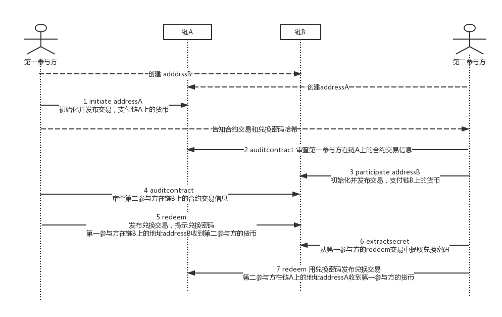

# 跨链资产原子转移工具包 Decred atomicswap 

[Decred](https://www.decred.org/) 是一种新型的去中心化加密货币。在2017年底，Decred的开发者发布了[atomicswap](https://github.com/decred/atomicswap)工具包，支持Decred与Bitcoin、Litecoin、Monacoin及其他一些加密货币的跨链原子互换。它的主要特点是：

- 去中心化，无需第三方托管

- 去信任化交易

- 点对点交易，抗审查

- 资产原子性转移

  ​

应用atomicswap的区块链需要支持以下条件：

- 交易脚本分支
- 交易脚本使用同样的哈希算法
- 交易脚本签名检查
- 交易脚本支持CheckLockTimeVerify或CheckSequenceVerify操作码

目前大部分从Bitcoin fork出来的加密货币都满足以上条件。

实现原理上，主要是利用了交易脚本功能实现合约交易。合约交易中会约定交换金额，接收方地址，兑换密码哈希，回退方地址，合约锁定时间等信息。其中兑换密码的设计用于保证原子互换、合约锁定的设计主要是用于保证违约情况下的资金正常回退。

正常情况下，一次交换过程需要双方执行多个步骤，同时双方在执行过程需要交互信息。原子互换过程主要用到以下命令：

- initiate <participant address> <amount>  

  用于第一个参与方初始化输出合约交易内容，兑换密码，兑换密码哈希，以及一个锁定48小时的回退交易等信息。

- participate <initiator address> <amount> <secret hash>  

  用于第二个参与方初始化输出与initiate类似的合约交易内容，不一样的地方在于secret hash参数必须与第一个参与方通过initiate命令生成的兑换密码一致，且回退交易的锁定时间是24小时。

- auditcontract <contract> <contract transaction>

  审查合约交易内容。主要是查看合约交易中的output接收地址、交换金额、兑换密码哈希、回退交易锁定时间。

- redeem <contract> <contract transaction> <secret>  

  用于参与方从合约中兑换另一方支付的货币。secret参数必须与initiate中的兑换密码一致。一旦第一个参与方发布redeem执行兑换，第二个参与方就可以执行extractsecret命令从交易中提取出兑换密码，再通过执行redeem兑换回自己的目标货币。

- refund <contract> <contract transaction>  

  用于创建和发送回退交易，将合约交易中的货币执行回退到原始发送方。

- extractsecret <redemption transaction> <secret hash>  

  用于第二个参与方从第一个参与方的redeem交易中提取兑换密码，并通过兑换密码从第一个参与方的合约交易中兑换目标货币。

一次正常的原子互换交互过程：

