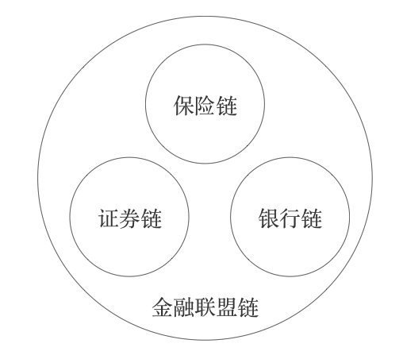
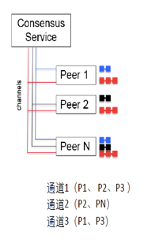
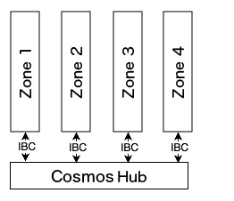
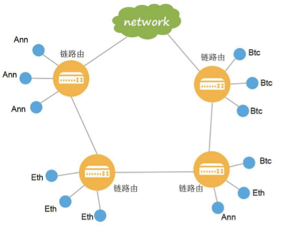

*本文为作者学习总结与思考，仅代表个人观点*

*欢迎转载 请注明出处*

*作者微信号：scut-guo*

*日期：2017年7月15日*

[TOC]

# 联盟链的多链与跨链的思考与实现（一）

## 公链、联盟链、私有链

​	源于数字加密货币在公众中的广泛流行，其背后的区块链技术也逐渐得到了公众广泛关注与主流机构的研究。当下区块链行业发展方兴未艾，各种技术发展迅速。目前对区块链技术的主流划分主要有公有链、联盟链、私有链。

​	以比特币、ZCash、以太坊等为代表的公链，有去中心化、去信任化、抗审查、加密数字货币经济、开放的智能合约生态等主要特点。

​	以R3、Hyperledger、金联盟为代表的联盟链，强调同业或跨行业间的机构或组织间的价值与协同的强关联性以及联盟内部的弱中心化。以降低成本、提升效率为主要目标。以强身份许可、安全隐私、高性能、海量数据等为主要技术特点。一般而言，联盟链的共识节点均是可验证身份的，并拥有高度治理结构的协议或商业规则。如果出现异常状况，可以启用监管机制和治理措施做出跟踪惩罚或进一步的治理措施，以减少损失。

​	私有链以强中心化为特点，被个人或机构所拥有，并拥有任意权力，无法被公众参与或第三方参与的区块链。常见于机构内部基于区块链技术开发的内部系统或网络。

​	尽管公有链、联盟链、私有链各有很多技术特点、应用场景、治理方式和目标上的差异，它们依然拥有区块链技术的以下基因：

- 点对点、分布式网络
- 密码学为基石
- 块链式
- 状态机式共识机制
- 一致性共享账本
- 等等

## 联盟链为什么需要多链架构

​	联盟链中对多链架构的需求可以归总为以下两点：

### 应用的需要

​	现有区块链技术在单链架构下存在性能、容量、隐私、隔离性、扩展上的瓶颈。

​	想象一个用户数以亿计的类VISA的支付应用，每秒交易请求高达几万笔，每日交易笔数高达几亿笔，用户交易达到秒级响应体验。在现有区块链技术下，数据存储采用链式本地存储导致无法平行扩展，共识机制采用同步式状态机模型导致无法高效处理交易，同时受限于网络中单节点的性能极限，因此单链架构无法满足应用的性能、容量、用户体验及其他要求。

​	另外一些应用内部需要根据业务功能的需要对数据做平行切分，以达到数据隔离的业务要求和安全要求，由于当前区块链技术体系中的单链中的每个全节点都拥有全网所有数据，因此无法满足此类应用要求。

​	另外区块链的互操作性本身就是一些应用的基础需求。想象一个理财应用，用户可以用某项资产交换不同机构的理财产品，不同的资产就需要在多条链上做转移、交换。还有一些ORACLE应用同样需要多链间的跨链喂入交互，譬如汇率牌价、天气、股价、特定指标等等。

​	因此联盟链的某些应用在单链上无法完整实现，需要在多链架构下的可扩展性、隔离性、高性能、互操作等特性的帮助下实现。

### 组织治理、成员协同的需要

​	联盟链是个广泛的治理共同体。但依旧允许广泛共同体下存在多个不同的小集体，既是允许机构或行业做更深度的治理收敛，同时多个不同的小集体又共享联盟链的基础设施。如果实际操作中以一个治理收敛为一条链，那多链既是更符合实际的治理场景。例如下图所示：

​    

## 前人的肩膀

​	在以太坊的Vitalik Buterin给R3的[跨链报告](http://www.r3cev.com/blog/2017/1/23/chain-interoperability)中归纳了三种跨链技术实现模式，见证人模式、中继模式和哈希锁定模式,对三种模式的实现做了简要分析，同时也对不同模式支持的功能集合和实现难度做了总结。也指出了联盟链和公有链在治理模型和失败模型上的不同，联盟链相对公有链可以选择更强一致性的共识算法以提高跨链安全性，同时联盟链也拥有更高的可监管度，进一步增强了跨链安全性。同时也强调，跨链技术的研究实现需要根据落地的应用场景来开展，不建议盲目使用跨链技术。

​	下面简要介绍在跨链领域中联盟链和公链的在多链和跨链的不同实现模式的代表技术架构。

### Corda

​	[Corda](http://www.r3cev.com/)是R3联盟推出的金融联盟“类区块链”技术架构。Corda中同样是用交易组成账本，但并没有区块，这个和传统区块链结构是个很大的不同。交易仅在参与方和公证人间传播。公证人是交易双方共同选择出来的，具有高度可信的特征。公证人负责验证数据的有效性和验证数据唯一性。

​	由于Corda选择了最高安全性的公证人模式，因此在跨账本消息处理上，变得较为简单。仅需选取不同账本的交叉公证人或者强行指向同一个验证人且让其账本同步即可安全的验证跨账本消息。

### Fabric

​	[Hyperledger](http://www.hyperledger.org/) Fabric是IBM 推出的企业级区块链开源架构方案。Fabric定义了链、Peer、通道、共识服务的概念。链代表了账本和对应的共识服务。一个Peer可以拥有多个逻辑账本，并且可以参与多条链。通道是将Peer连接共识服务的虚拟通信方式。共识服务既是可信的与链无关的公共服务。

​	Fabric的扩展性上主要得益于Peer可以参与多个账本。Fabric强调Peer的隔离性,如Peer之间的事务隔离、账本隔离。同时也有不支持跨链路由，不支持跨链事务，跨链只读的特点。 

### Cosmos

​	[Cosmos](https://cosmos.network/)是Interchain Foundation的跨链开源项目。Cosmos是专注于解决跨链资产转移的区块链网络。网络主要由两部分组成，Cosmos Hub和若干个Zone。每个Zone可以看做是单独的区块链空间。每个Zone会和Hub保持状态同步。Hub通过去中心化的验证人组来保证安全性，验证人组有罚金托管机制，它是唯一的多资产中心账本，并负责保证各类资产在不同Zone转移的同时，资产总量不变。

​	Hub既是中继链。Zone之间的跨链通信主要是通过与Hub之间的IBC协议来实现。Zone1向Zone2做跨链消息时，Zone1先生成消息包，并将其证明发布在Hub上，接下来Hub会生成Zone1的跨链消息包已在Hub上的存在证明的证明发布于Zone2，接下来Zone2收妥消息包，并给出证明发布于Hub上，最后，Hub再给出Zone2的收妥证明的证明发布于Zone2。完成整个跨链消息传递。 

### PolkaDot

​	[PolkaDot](https://polkadot.network/)是Web3基金会的跨链协议开源项目。由Parity团队的Gavin Wood主导开发。PolkaDot是未来Web3.0时代[^1]的基础设施之一，是一个未来“区块链互联网”的基础协议。PolkaDot协议强调解决当前区块链技术的伸缩性和隔离性问题，以提供众多异构区块链系统之间去信任、去中心化的通用的互访问性、互操作性为目标。PolkaDot与Cosmos的不同在于，Cosmos专注于跨链价值转移，而PolkaDot则是更为通用更具备普适性的跨链协议，远景更为宏大。

​	PolkaDot Platfrom是对PolkaDot协议的一个实现。它是中继链实现模式。它把通过PolkaDot进行跨链交互的区块链称为平行链。可以认为中继链是多个平行链的集合。中继链上分为不同的验证人组来形成共识网络，同时每个平行链也拥有自己的验证人组，该平行链的验证人组也参与到中继链的锻造中。平行链的收集人负责收集执行平行链中的跨链消息组成候选块，并提交给验证人。验证人组会对候选区块进行验证和发布。中继链通过队列的机制将跨链消息在不同的平行链之间进行转移，通过中继链的区块锻造达成消息的跨链传递和跨链状态同步。

[^1]: Web3.0时代：是相对于Web1.0时代（静态网站，无交互）、Web2.0时代（动态网站）而言，Web3.0时代指的是去中心化的互联时代 

### InterLedger

​	[InterLedger](https://interledger.org/)是由Ripple公司主导发起的跨账本价值传输开放协议。InterLedger不是区块链，它是连接各类账本的支付标准、统一协议。IntrLedger专注于跨账本间资金流动领域。

​	各类账本通过去信任的第三方“连接器”来互相连接。InterLedger协议是哈希锁定的实现模式。它会为交易参与的双方实现资金的锁定与托管。当交易双方达成交易共识时，跨账本的资金流动马上原子性发生。

### 安链	

​	由[众安科技](https://www.anlink.com/)推出的企业级区块链产品。其中提出了链路由，定义了多区块链之间的通信协议、路由协议，同时在其之上维护区块链间的网络拓扑地图。目标是解决区块链之间的连接与分发问题。链路由可以多层次组合构成分层网络结构。简而言之，链路由仅支持多链路由，不支持跨链互操作。 

​	

​	上面简要讨论了业界实在不同跨链技术模式下的实现案例，下面的表格试图从安全性 、伸缩性 、可用性 、互操作性 、功能性 进行简单的总结。需要注意的是，该总结仅代表个人看法，表格中的总结并不是绝对的。譬如哈希锁定可以使用安全验证人的共识机制增强安全性，譬如路由分发可以通过中继式增强协议来提高互操作性。等等。

*（下表只代表个人观点）*

| 模式   | 代表系统            | 安全性[^2] | 伸缩性[^3] | 可用性[^4] | 互操作性[^5] | 功能性[^6] | 复杂度  | 优点           | 缺点              |
| ---- | --------------- | ------- | ------- | ------- | -------- | ------- | ---- | ------------ | --------------- |
| 见证人  | Corda           | 高       | 中       | 高       | /        | 高       | 中    | 强隐私、灵活       | 中心化风险           |
| 中继   | PolkaDot与Cosmos | 中       | 高       | 中       | 高        | 高       | 高    | 互联互通、跨异构     | 低吞吐             |
| 哈希锁定 | InterLedger     | 中       | 中       | 中       | 中        | 中       | 中    | 高性能、高吞吐      | 不完整性、篡改风险、中心化风险 |
| 其他   | 安链路由与Fabric     | /       | /       | /       | /        | /       | 低    | 强隔离、高性能、业务友好 | 限同构             |

[^2]: 安全性指的是数据存在性证明的去信任化程度。注意绝对安全和相对安全的不同。
[^3]: 伸缩性指的不仅包含扩展性还包括异构系统和同构系统的通信自由度。
[^4]: 可用性指的是系统数据可访问性和用户体验的友好度。 
[^5]: 互操作性指的是链和链之间的双向交互能力。
[^6]:  功能性指的是功能模型的丰富性如资产转移、资产交换、ORACLE等等。

## 联盟链的多链架构特点与挑战	

### 安全性

​	多链架构对安全性是有高要求的。安全性的要求主要来源于两方面，一方面来源于区块链自身安全，包括网络通信安全、数据安全、应急处理等等。另一方面来源于跨链机制安全，包括消息有效性及互操作的合法性控制。

​	一般而言，为了安全考虑，机构节点会在网络通信层、落盘存储层、数据隐私等方面进行多层次安全防护，以加强区块链网络安全。同时，联盟链也拥有严格身份许可管理和权限管理机制。一方面，参与区块链共识的节点都具有唯一的公开的链上身份信息和链下可追溯的机构身份。另外一方面机构的用户都是经过严格的KYC机制过滤，即是说区块链交易的参与者都是可确定的。在特殊情况下，参与机构们可以在链下有一致行动的应对能力。因此参与机构对联盟链网络有高度把控能力。

​	因此如何实现跨链机制的安全性是多链架构中的重要考量。在协议设计上需要达到以下几点：	

- 消息的高效路由机制

- 消息发送方的身份证明

- 消息接收方的存在证明
- 消息有效性的自我证明
- 消息的生命期管理

### 一致性

​	一致性是分布式系统中重要的目标之一。在联盟链中采用的PBFT类共识算法较为高效的解决了多节点参与情况下的典型分布式一致性问题，如消息无序、参与方异常、网络分化等同时，在允许一定比例的拜占庭参与方的前提下，做到了最终一致性

​	在跨链场景中，跨链交易的一致性问题有所简化。因为每次交互可以认为只有两方参与（不讨论一对多的跨链交易）。其中参与一方在执行跨链交易前，必须先确认消息的合法性。而由于联盟链一般对区块附带签名，且不会运行时分叉切换。故消息的合法性验证较为容易。因此，一致性问题退化为跨链交易原子性问题。

​	交易原子性问题也分为两种类型的解决方法，强原子性和最终原子性。

​	强原子性方法的其中一种是发生跨链交易时，交互的两条链针对当前区块，临时组成一条链，两条链的共识节点组成这个临时链的共识节点组，两条链的所有共识节点都参与出块签名，签名数据和出块条件都满足两边需要，两边共识算法要保持一致或兼容，且新跨链的区块能同时无缝接入两条链。另一种是验证人的实现方式，额外选出一组双方认可的第三方验证人组处理跨链交易，且第三方链处理后的账本数据被交易双方所认可为各自账本的一部分。上面所列可以归结为一次共识过程解决跨链原子性问题，解决问题的着力点在共识算法创新上。目前业界[L0](http://www.bocheninc.com/)的实现类似方法一。

​	最终原子性方法是类似中继链，和哈希锁定的方式。通过双向锁定、资产托管的方式来实施过程控制。总而言之，可以归结为多次共识过程的思路。

​	在具体实现中，采用哪种方法，需要根据参与方角色、业务场景特点、可用性要求、性能要求、时间进度要求等来做综合考量。

### 可用性

​	可用性代表的是区块链网络的数据可访问性。

​	在多链无跨链的场景中，业务请求根据不同路由规则访问不同的单链，某个单链的不可用只会影响本链请求，其余链的请求依然可以正常处理，因此多链架构极大提升了整体可用性。然而在跨链场景却变得复杂。某个单链的不可用不仅影响本链的请求，还影响了其他链的发出的跨链交易请求，导致其他链自身交易处理失败，进一步降低整体可用性。

​	根据分布式系统的CAP理论。系统设计中，在分区容错性必须接受的现实情况下，需要对可用性和一致性做折中和权衡。在联盟链跨链交易场景中，具体而言，有几点需要考量

- 交易时延的要求
- 交易对原子性的要求
- 交易状态的背书对一致性的影响
- 治理模型失败的影响

# 联盟链的多链与跨链的思考与实现（二）

*主要介绍联盟链的跨链资产转移&跨链资产交换的实现方案*

