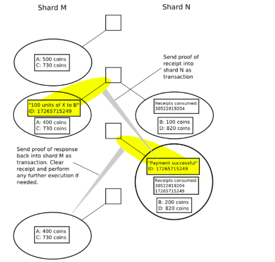
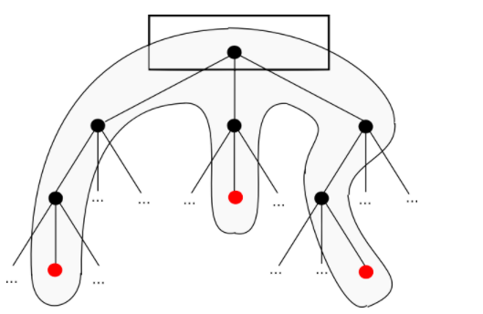
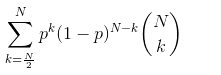

# 译文：以太坊Sharding FAQ

原文：https://github.com/ethereum/wiki/wiki/Sharding-FAQ  作者：vbuterin 

*译注：原文内容在不断更新，本译文不一定是最新的~*

## 简介

目前，在所有的区块链协议中每个节点存储所有的状态（账户余额，合约代码和存储等等）并且处理所有的交易。这提供了大量的安全性，但极大的限制了可扩展性：区块链不能处理比一个单节点更多的交易。很大程度上因为这个原因，比特币被限制在每秒3-7笔交易，以太坊每秒7-15笔交易，等等。然后，这提出了一个问题：是否有方法创建一个新的机制，只让一个小集合的节点来验证每笔交易？只要有足够多的节点验证每笔交易那么系统依然是高度安全的，但又足够少使得系统系统可以并行处理很多的交易，我们是否可以使用这种技术来大大增加区块链的吞吐量？

## 有哪些简单但有缺陷的方式来解决这个问题？

”简单的解决方案“主要由三大类。第一个是直接放弃独立区块链缩放性，而是假设用户将使用许多不同的”altcoins"。这种方法极大提升了吞吐量，但是是以安全性为代价：使用这种方案在在吞吐量上N-factor的增加必然伴随在安全性上N-factor的下降。因此，对于大于N小值可以被论证是不可行的。

第二个是简单增加区块大小限制。这种方式可以起作用，而且在某些情况下可能是正确的处理方法，因为区块链大小可能更多受到政治上的约束而不是现实的技术考量。但不管个人对于个别案例的信念如何，这个方案不可避免有它的局限性：如果区块链运行的足够长，那么运行在消费者硬件上的节点就会退出，网络将开始只能依赖于少数运行区块链的超级计算机，者可能导致极大的中心化风险。

第三个是“合并挖矿”，这是一种多区块链共存的技术，但所有的区块链共享同一的挖矿激励（或者权益证明系统中的赌注）。目前，Namecoin通过这样的技术从比特币区块链中获取了很大一部分的安全性。如果所有的矿工参与进来，理论上可以将吞吐量提升N倍而不会影响安全性。然而，这也存在这样的问题：它将每个矿工的计算和存储负载增加了N倍。所以，实际上这个方法仅仅是一个隐藏的区块大小限制提升方式。

即使这被认为可以接受的，依然存在这样的缺陷：这些区块链不是真正被“捆绑在一起"的；只需要少量的经济激励就能说服矿工放弃或妥协某个特定的区块链。这种可能性是非常真实的，并且有合并挖矿被攻击的[真实历史事件]([actual historical incidents](https://web.archive.org/web/20170331105910/https://bitcoin.stackexchange.com/questions/3472/what-is-the-story-behind-the-attack-on-coiledcoin))，以及明确提倡使用合并挖矿攻击作为一种“[治理特性](http://www.truthcoin.info/blog/contracts-oracles-sidechains/)”的开发者，对于给定的联盟，破坏区块链并不是有利可图的。

如果每条链只有少数矿工参与合并挖矿，则集中化风险得到缓解，但合并挖矿的安全效益也大大降低。

## 这听起来像是有某种扩展性三难困境在起作用。这三难困境是什么呢，我们能突破它吗？

这三难困境表明区块链系统最多只能拥有以下三个属性中的两个：

- 去中心化（定义为系统可以在每个参与者只能访问O(c)资源的场景下运行，即普通笔记本电脑或小型VPS）

- 扩展性（定义为可以处理O(n) > O(c)交易）
- 安全性（定义为最多使用O(n)资源就可以抵御安全攻击）

在这个文档的其余部分，我们继续使用c来指代每个节点的可用计算资源大小（包括计算，带宽和存储），以及用n指代抽象意义上生态系统的大小；我们假设交易负载，状态大小和加密货币市值都与n成正比。

## 有人认为，由于梅特卡夫定律，一个加密货币的市值应该与n ^ 2成正比，而不是n。 他们是正确的吗？

不。

## 为什么不？

梅特卡夫法则认为，网络的价值与用户数量的平方成正比（n ^ 2），因为如果网络有n个用户，那么网络对每个用户都有价值，但是每个用户的价值是与用户数量成正比，因为如果一个网络有n个用户通过网络有n-1个潜在的连接，每个用户都可以从中受益。

在实践中，[实证研究表明](https://en.wikipedia.org/wiki/Metcalfe%27s_law)，拥有n个用户的网络的价值”对于小的n值是与n ^ 2成比例且对于大的n值是与n×log n成比例“。这很容易理解，因为对于小的n值，这个论点是成立的，但是一旦这个系统变得很大，两个影响就会减缓增长。首先，实践中的增长通常发生在社区中，因此在中等规模的网络中，网络通常已经提供了每个用户关心的大部分连接。其次，连接往往是可以互相替代的。你可以争论说人们从k个连接中只能获得~O(log(k))的价值-有23个品牌的除臭剂可以选择是好的，但并不不是说比有22个选择好多了，而一个选择和零个选择是非常重要的差异。

另外，即使加密货币的价值与k个用户的O(k * log(k))成正比，如果我们接受上述解释作为这种情况的原因，那这也意味着交易量也是O(k * log(k))，因为每个用户的log(k)价值理论上来自于用户通过网络执行log(k)的连接，并且状态大小在许多情况下也应该随着O(k * log(k)) 一起增长，因为至少有某种类型的状态是特定关心而不是用户特定的。因此，假设n=O(k * log(k)) ，并且基于n(生态系统大小)和c（单节点的计算能力）是我们使用的完美模型。

## 有哪些适度简单但只部分解决了可扩展性问题的方法？

许多分片建议（[比如国大的Loi Luu等人提出的这个早期的BFT分片方案](https://www.comp.nus.edu.sg/~loiluu/papers/elastico.pdf)，以及为比特币提议的[this Merklix tree](http://www.deadalnix.me/2016/11/06/using-merklix-tree-to-shard-block-validation)方案）都试图只分片交易或者只分片状态，而不考虑其他方面。这些努力是令人钦佩的，可能会带来效率上的提升，但他们遇到根本性的问题，他们只能解决其中一个瓶颈。我们希望能够每秒处理超过10000个交易，而即不必强迫每个节点成为超级计算机也不强迫每个节点存储一兆字节的状态数据，而这需要一个全面的解决方案即状态存储工作量，交易处理甚至交易下载和广播都跨节点分散。

特别要注意的是，这要求在P2P级别做出变更，因为广播模型是不可扩展的，因为它要求每个节点下载和重复广播O(n) 的数据（每个被发送的交易），而我们去中心化的标准假设是每个节点只能访问各种O(c)资源。

## 有哪些不试图“分片”任何东西的方法？

[Bitcoin-NG]([Bitcoin-NG](https://www.google.com/url?q=http://hackingdistributed.com/2015/10/14/bitcoin-ng/&sa=D&ust=1480305371200000&usg=AFQjCNFUUZstMrcmGGD_-KtPFIH_woQnsA)) 可以通过另外一种区块链设计来增加扩展性，即如果节点花费大量CPU时间验证区块来使得网络更安全。在简单的PoW区块链中，存在较高的中心化风险，并且如果阀值增长到节点的CPU时间超过5%用于验证块则共识安全就会被削弱；Bitcoin-NG的设计缓解了这个问题。然而，这仅仅使得交易扩展性提升了大约常量因子5-50x3,4，但并没有提升状态扩展性。也就是说，Bitcoin-NG式的方法与分片并不互相排斥，两者当然可以同时实施。

基于通道的策略（闪电网络，雷电网络等）可以通过常量因子扩展交易容量，但不能扩展状态存储，并且还会带来他们自己独特的折衷和限制，特别是涉及到拒绝服务攻击；通过分片实现链上扩展（加上其他的技术）和通过通道实现链下扩展可以说是必要和互补的。

还有其他一些使用高级密码学的方法。如[Mimblewimble](https://scalingbitcoin.org/papers/mimblewimble.txt) 和基于ZK-SNARKs的策略来解决扩展性问题的特定部分。初始化全节点同步，而不是从创世块验证整个历史，节点可以验证一个密码学证明当前状态合法地遵循历史记录。这些方法确实解决了合法性问题，但是值得注意的是，可以依靠加密经济学用更简单的方式而不是纯粹密码学来解决同样的问题-参见以太坊当前[快速同步](https://github.com/ethereum/go-ethereum/pull/1889)和[神同步](https://github.com/ethcore/parity/wiki/Warp-Sync)的实现。这两种方法都没有缓解状态大小的增长或者在线交易处理的限制。

## Plasma 如何适应三难困境？

在Plasma子链发生较大攻击的时候，Plasma子链的所有用户需要提现回根链。如果Plasma有 O(N)用户，那么就需要 O(N)的交易，所以需要 O(N/C)的时间来处理所有的提现。如果提现延迟固定在某个D上（即天真的实现），那么只要N>C*D，区块链中就没有足够空间来及时处理所有的提现，这样系统将变得不安全。在这种模式下，Plasma应该被视为只通过一个（可能很大）常数因子来提升扩展性。如果提现延迟是灵活的，那么如果有很多的提现发生他们会自动延长，这意味着当N增长的越来越大，攻击者迫使所有人的资金被锁定的时间越来越长，系统的“安全性“级别在一定意义上进一步降低。因为扩展的拒绝访问可以被认为是安全上的失败，尽管比失去所有访问要折衷些。然而，这是与其他方案不同的折衷方案，可以说是一个更温和的折衷，所以Plasma子链为什么依然是现状的巨大改进。

## 状态大小，历史，加密经济学，哦，我的天！在我们继续之前，先定义一些这样的术语！

- 状态 代表系统”当前状态“的一个信息集合；确定交易是否有效，以及交易的结果，在最简单的模型中应该仅仅依赖状态。例如比特币中UTXO的状态数据，以太坊中的balances+nonces+code+storage，Namecoin中的域名注册项。
- 历史：自从创世块以来的所有交易的有序列表。在一个简单模型中，当前状态应该是创世状态和历史的确定性函数。
- 交易：进入历史的一个对象。在实践中，一笔交易代表了某用户想要做的操作，并且是加密签名的。
- 状态转换函数：一个获取状态，应用交易并输出新状态的函数。涉及的计算可能包含对交易指定的账户中增加或减少余额，验证数字签名和运行合约代码。
- 默克尔树：可以存储大量数据的加密哈希树结构，其中验证每个单项数据项只需要O(log(n)) 的空间和时间。详情看[这里](https://easythereentropy.wordpress.com/2014/06/04/understanding-the-ethereum-trie)。在以太坊中，每个块的交易集合已经状态都保存在默克尔树中，树的根被提交在块中。
- 收据：代表交易执行结果的对象，它并不存储在状态中，但仍存储在一个默克尔树中并提交到块，以便节点在没有拥有所有数据的情况下可以高效验证证明。在以太坊中Logs就是收据。在分片模型中，收据是用来促进异步跨分片通信。
- 轻客户端：与区块链交互的一种方式，它只需要非常少量的计算资源，默认情况下只需要跟踪链的区块头，并根据需要请求关于交易，状态和收据的相关信息，并验证相关数据的默克尔证明。
- 状态根：代表状态的默克尔树根哈希。

## 分片背后的基本思想？

把状态分成K = O(n / c) 分区，我们称之为”分片“。例如，以太坊的分片方案可能会将所有0x00开头的所有地址放入一个分片，所有以0x01开头的地方hi放入另外一个分片等等。在最简单的分片形式中，每个分片都有自己的交易历史，且在某个分片k中的交易影响仅限于分片k的状态。一个简单的例子是多资产区块链，其中有k个分片，每个分片存储余额和处理一个特定资产相关的交易。在更高级的分片形式中，包括了某些形式的跨分片通信能力，其中一个分片上的交易可以出发其他分片上的事件。

## 分片区块链的基本设计是怎么样的？

一个简单的方法如下。存在一些称为协调者的节点，其接受在分片k上的交易（取决于协议，协调者可以选择哪个k分片或者随机分配k）并创建排序规则。一个排序规则有一个排序头，一个形式为”这是在分片k上的交易排序“的短消息。它期望分片k的前状态根是0x12bc57，在当前排序的交易默克尔树根是0x3f98ea，并且交易被处理之后的状态根应当是0x5d0cc1。且协调者#1，2，4，5，8，11，13...98，99对其签名。

一个区块必须包括每个分片的排序头，在以下情况下区块是有效的：

1. 在每个排序规则中给出的前状态根必须与相关联的分片当前的状态根相匹配
2. 在排序规则中所有的交易是有效的
3. 在排序规则中给出的后状态根必须与上面给定的状态执行排序规则中的交易结果想匹配
4. 排序规则必须被该分片的至少三分之二已注册的协调者所签名

需要注意的是，在这样的系统中现在存在几个”层次“的节点：

- 超级全节点- 处理在所有排序规则中的所有交易，并且维护所有分片的全状态
- 顶级节点- 处理所有顶级(top-level)区块，但不处理或试图下载在每个排序规则的交易。相反，如果在某个分片中有三分之二协调者认为一个排序规则是有效的，那么这个排序规则就是有效的。
- 单分片节点- 充当顶级节点，但同时也处理某个分片的所有交易和维护全状态。
- 轻节点- 仅下载和验证顶级区块的区块头；不处理任何排序头或交易，除非它需要读取某个特定分片的状态的某些特定信息，在这种情况下，它下载该分片最近的排序头的默克尔分支并且下载在该状态下的默克尔证明期望值。

## 这里面临的挑战是什么？

- 跨分片通信- 上述设计不支持跨分片通信。我们如何安全地增加跨分片通信。
- 单分片接管攻击- 如果在一个分片中攻击者接管了大多数协调者，要么获取足够的签名来阻止任何排序规则，要么更糟糕的，提交无效的排序？
- 欺诈检测- 如果得到一个无效的排序规则，节点（包括轻节点）如何能够可靠的得知，以便它们可以验证欺诈行为并且确认是欺诈行为之后拒绝这个排序规则？
- 数据可用性问题- 作为欺诈检测的子集，排序规则中缺失数据这种特殊情况会怎么样？
- 超二次分片- 在n > c^2的特殊情况下，在上面给出的简单设计里面，将会有超过O(c)的排序头，因此普通节点将不能处理它们，只能处理顶级区块。因此，在交易和顶级区块头直接超过两级的间接寻址是需要的（即我们需要”分片的分片“）。达到这个目标的最简单和最好的方式是什么呢？

然后，交易的结果取决于之前发生在其他分片中的事件；一个典型的例子是货币转账，货币可以从分片i转移到分片j，首先在分片i中创建一个”借记“交易来销毁代币，然后在分片j中创建一个”贷记“交易来创建代币，并将借记交易的收据作为贷记证明是合法的。

## 但是CAP定理意味着完全安全的分布式系统是不可能的，因此分片是无法实现的？

CAP定理是于分布式共识有关的结果。一个简单的描述是：”在网络发生分区的情况下，你必须选择一致性或可用性，你不能同时拥有两者“。直观的论点很简单：如果网络分为两半，在一半网络中发送交易”发送10个代币给A"，而在另一半发送交易”发送10个代币给B“，然后系统是不可用的，因为其中一个或者两个交易将不被处理，或者变得不一致，因为一半的网络将看到第一个交易完成，另一半将看到第二个交易完成。注意CAP定理与扩展性无关；它适用于多节点需要对某个值导致一致的任何情况，而不管它们所达成一致的数据量大小。所有现有的去中心化系统已在可用性和一致性之间找到一些折衷方法，在这方面分片并没有从根本上造成困难。

## 我们如何促进跨分片通信？

最容易满足的一个场景是，有许多的应用程序没有太多独立用户，而且这些应用程序只是偶尔或者很少与彼此交互；在这种情况下，应用程序可以在单独的分片上生存，并通过使用收据来与其他分片进行通信。

这通常涉及将每笔交易分解为”借记“和”贷记“。例如，假设我们有一个交易，其中账户A在分片M上，期望发送100个代币到分片N上的账户B。这些步骤如下所示：

1. 在分片M上发送一个交易（i)扣除账户A的100个代币（ii) 创建一个收据。收据对象并不直接保存在状态中，但收据的生成能通过默克尔证明来验证。

2. 等待第一个交易被包含进来（有时候需要等待终止化，这取决于系统）

3. 在分片N上发送一个交易，包含来自（1）收据的默克尔证明。这个交易也检查分片N上的状态以确保收据是”未花费“；如果是的话，那么它将账户B增加100个代币，并且保存在状态中代表收据已花费。

4. 可选地，（3）中的交易也保存收据，然后可以在分片M中用来执行进一步的操作，这取决与原操作是否成功。

   

在更复杂的分片形式中，交易在某些场景下可能具有分散在不同分片上的效果，并且可以从多个分片状态中同时请求数据。

## 不同类型的应用程序如何与分片区块链融合？

有些应用程序完全不需要跨分片交互；多资产区块链和不需要互操作性的完全异构应用程序的区块链是最简单的案例。如果应用程序不需要彼此交互，如果可以异步交互，面临的挑战会更容易应对。也就是说，如果交互可以以分片A上的应用程序的形式完成，则生成收据，在分片B上的交易“消费”该收据并基于它执行一些操作，并且可能向分片A发送包含某些响应的“回调”。总的来说这个模式是很简单的，并且不难将其整合入高级程序语言中。

需要注意的是，与可用于分片内通信的机制相比，用于异步跨分片通信的协议内置机制可能会有所不同并且功能较弱。在不可扩展的区块链中的当前可用的一些功能在可扩展区块链中只能用于分区内通信。

## 什么是火车旅馆问题？

下面的例子是Andrew Miller提供的。 假设用户想要购买一张火车票并预订一家旅馆，并且想要确保这个操作是原子的 - 无论是保留成功还是两者都不成立。 如果火车票和酒店预订应用程序在同一个分片上，这很容易：创建一个交易，试图进行两个预订，除非两个预订都成功，否则引发异常，并且回滚所有。 但是，如果两者在不同的分片上，这并不是那么容易; 即使没有加密经济/去中心化的问题，这实质上也是[数据库原子事务](https://en.wikipedia.org/wiki/Atomicity_(database_systems))的问题。

只有异步消息，最简单的解决方法是先预订火车，然后再预订旅馆，然后一旦两个预订都成功就都确认；预订机制将阻止其他人预留（或者至少会确保有足够的空间开放让所有的预订被确认）一段时间。然而，这意味着该机制依赖于额外安全假设：来自于跨分片的消息可以在固定的周期内被包含在另外的分片中。

使用跨分片同步交易，问题更容易，但创建可以跨分片原子同步交易的分片解决方案的挑战本身绝对是重要的。

如果单个应用程序的使用量超过 O(c)，则该应用程序需要存在多个区块链中。这样做的可行性取决于应用程序自身的具体情况。一些应用程序（如货币）很容易并行化，而另外一些应用程序（例如某些类型的市场设计）则不能并行化智能串行处理。

我们知道分片区块链的属性有一个事实是不可能实现的。[阿姆达尔定律](https://en.wikipedia.org/wiki/Amdahl%27s_law) 表明在应用程序有任何不可并行化组件的情况下，一旦容易获得并行化，不可并行化组件就会快速成为瓶颈。在像以太坊的通用计算平台中，很容易提出不可并行化计算的例子：一个跟踪内部变量x的合约，一旦接到到一个交易就将变量x设置为sha3(x, tx_data)就是个简单的例子。没有分片方案可以给与这种形式的个别应用程序超过O(c)的性能。因此，随着时间的推移，分片区块链协议将会越来越好地能够处理越来越多样化的应用程序类型和应用程序交互，但分片架构至少在规模超过O(c)的某些方面总是落后于单分片的架构。

## 我们正在运行的是哪些安全模型？

评估区块链设计的安全性有几个竞争模型：

- 诚实的大多数（或诚实的绝对多数）：我们假设有一组验证者，而且这些验证者的½（或⅓或¼）由攻击者控制，其余的验证者诚实地遵循协议。
- 不协调的大多数：我们假设所有的验证者在博弈论的上都是合理的（除了攻击者，他们有动机使用某种方式来攻击网络），但是不超过一部分（通常在¼和½之间）协调他们的行动。
- 协调选择：我们假定所有的验证者都是由同一个参与者控制的，或者完全有能力协调他们之间的经济上最优的选择。我们可以讨论联合的成本（或联合的利润）达到一些不良的结果。
- 贿赂攻击者模式：我们采取不协调的多数模型，而不是让攻击者成为参与者之一，攻击者处于协议之外，并有能力贿赂任何参与者来改变他们的行为。攻击者被模拟为拥有预算，这是他们愿意支付的最高金额，我们可以讨论他们的成本，即他们最终为破坏协议平衡而支付的金额。

比特币的[Eyal and Sirer’s selfish mining fix](https://arxiv.org/abs/1311.0243) 工作量证明是健壮的，在诚实的大多数高达½的假设下，在不协调的大多数高达¼的假设下。[Schellingcoin](https://blog.ethereum.org/2014/03/28/schellingcoin-a-minimal-trust-universal-data-feed/) 在诚实的大多数假设和在不协调的大多数假设下高达½，在协调选择模型下具有ε（即略微大于零）的攻击成本，并且在贿赂攻击者模型中由于[P + epsilon attacks](https://blog.ethereum.org/2015/01/28/p-epsilon-attack/) 要求具有P + ε预算要求和ε成本。

混合模型也是存在的。例如，即使是在协调选择模型和贿赂攻击者模型中，通常也会做出一个诚实的少数人的假设，某些部分（可能是1-15％）的验证者会无视激励而采取利他行为。 我们也可以讨论由50-99％的验证者组成的联盟，试图破坏协议或伤害其他验证者; 例如在工作量证明中，一个51%算力大小的联盟可以通过拒绝包含其他矿工产出的区块来增加增加自己的收入。

诚实的大多数模型可能是非常不切实际的，并且已经被证明了-比特币的[SPV mining fork](https://www.reddit.com/r/Bitcoin/comments/3c305f/if_you_are_using_any_wallet_other_than_bitcoin/csrsrf9/) 是个实际的例子。它证明了很多；例如，一个诚实的大多数模型意味着诚实的矿工自愿烧毁他们自己的资金，以某种方式惩罚攻击者。不协调的大多数模型的假设可能是现实的；还有个中间模型，其中大多数节点是诚实的但有个预算，如果他们失去了太多资金就回停止。

贿赂攻击者模式在某些情况下被批评为不切实际的对抗行为，尽管其支持者认为，如果一个协议的设计考虑了贿赂攻击者模型，那么它应该能够大幅降低共识成本，因为51％的攻击变成一个可以从中恢复的事件。 我们将在不协调的大多数和贿赂攻击者模型的背景下评估分片。

## 我们如何解决在不协调的大多数模型中的单分片接管攻击？

简单来说，随机抽样。 每个分片被分配一定数量的协调者（例如，150），在每个分片上批准区块的协调者都是从分片的样本中获取的。样本可以半频繁地（例如每12小时一次）或最频繁地（也就是说，没有真正的独立抽样过程，每个块从全局池中的每个分片随机选择协调者）进行重新洗牌。

结果是，在一个诚实/不协调的多数模型中，相对于每一个单节点正在验证和创建块，即使在任何给定的时间在每个分片上只有几个节点验证和创建块，安全级别实际上并不低得多。 原因是简单统计：如果你在全局集合上假设一个⅔诚实的绝对多数，如果样本的大小是150，那么以99.999％的概率就可以满足样本的诚实多数条件。 如果你假定在全局组合上有一个¾诚实的绝对多数，那么这个概率就会增加到99.999999998％（这里请看[细节](https://en.wikipedia.org/wiki/Binomial_distribution) )。

因此，至少在诚实/不协调的大多数情况下，我们有：

- 去中心化（每个节点只存储O(c) 数据，因为它是O(c) 分片的一个轻客户端，所以存储O(1) * O(c) = O(c)的块头数据，以及对应于当前分配给它的一个或多个分片的完整状态和近期历史的O(c)数据）
- 可扩展性 （有O(c) 个分片，每个分片有O(c) 的容量，最大容量是n = O(c^2))
- 安全性（攻击者需要控制整个O(n)大小的验证池中的至少 ⅓ ，以便有机会接管网络）。

在Zamfir模型中（或者在“非常非常适应性的对手”模型中），事情并不是那么容易，但是我们稍后会做到这一点。 请注意，由于采样的不完善性，安全阈值确实从1/2降低到了⅓，但相对于可能是100-1000倍的可扩展性收益而不会损失去中心化，这仍然是一个令人惊讶的低安全性损失。

## 你如何在工作量证明和权益证明中做这个抽样？

在权益证明中，这很容易。 已经有一个“活动验证者集合”在状态中被跟踪，并且可以直接从这个集合中简单地抽样。 协议内算法运行并为每个分片选择150个校验者，或者每个校验者独立地运行一个算法，该算法使用一个共同的随机源来（可证实地）确定它们在任何给定时间的分片。 请注意，抽样任务是“强制性的”是非常重要的。 验证者不能选择它们进入的碎片。 如果验证者可以选择，那么攻击者可以用小权益集中他们的权益到一个分片上并攻击它，从而消除系统的安全性。

在工作量证明中，这是比较困难的，就像“直接的”工作量证明计划一样，不能阻止矿工将工作量于某一特定的分片。 有可能使用[proof-of-file-access forms](https://www.microsoft.com/en-us/research/publication/permacoin-repurposing-bitcoin-work-for-data-preservation/)工作量证明来将个人矿工锁定到单独的分片，但是很难确保矿工不能快速下载或生成可用于其他分片的数据并因此避开 这种机制。 最为人所知的方法是通过Dominic Williams发明的一种叫做“拼图塔”的技术，矿工首先在一个共同链上进行工作量证明，然后将这些证明导入到关于权益风格验证池的证明中，然后验证池就像在权益证明的情况下一样。

一个可能的中间路线可能如下所示。 矿工可以花费大量的（O(c)大小）工作来创建一个新的“密码身份”。 工作量证明方案的确切值，然后选择他们在哪个分片上产生下一个块。他们可以花费O(1)大小的工作量在分片上创建一个块，然后工作量证明的价值决定了他们接下来可以继续产块的分片。注意的是，所有这些方法都以某种方式工作量证明“有状态”，这是必要的。

## 取样的频率高低有哪些折衷？

选择频率只影响如何自适应攻击者使得协议仍然安全防御他们; 例如，如果您认为适应性攻击（例如不诚实的验证者发现他们是同一个样本的一部分并且共同勾结）可能在6小时内发生但不会更早，那么采样时间为4 小时而不是12小时。 这是一个赞成尽快抽样的理由。

每个区块进行抽样的主要挑战是重新改组会带来非常高的开销。 具体来说，验证分片上的块需要知道该分片的状态，因此每次验证器被重新改组时，验证器需要下载他们所在的新分片的整个状态。这需要强大的状态大小控制策略（即经济上确保状态不会增长过大，无论是删除旧账户，限制创建新账户的比率还是两者的结合），以及相当长的重组时间。

目前，Parity客户端可以在〜3分钟内通过“warp-sync”下载和验证完整的以太坊状态快照; 如果我们增加20倍以弥补增加的使用量（10 tx / sec而不是0.5 tx / sec）（我们假定未来的状态大小控制策略和从长期使用中积累的“灰尘”大致抵消了） 得到约60分钟的状态同步时间，这表明12-24小时的同步周期但不少于是安全的。

有两条可能的途径可以克服这个挑战。

## 我们是否可以强制更多的状态保持在用户端，以便交易可以被验证，而不需要验证器来保存所有的状态数据？

这里的技术往往涉及要求用户存储状态数据，并为他们发送的每一个交易单独提供Merkle证明。 一个交易将与一个正确执行Merkle证明一起发送，这个证明将允许一个只有状态根的节点计算新的状态根。 这种正确执行证明将包括需要遍历的trie中对象的子集，以访问和验证交易必须验证的状态信息; 因为Merkle证明的大小是 O(log(n))，所以访问恒定数量对象的交易证明也是 O(log(n))大小。

*Merkle树中对象的子集，需要在访问多个状态对象的交易的Merkle证明中提供*

以纯粹的形式实施这个计划有两个缺陷。 首先，它引入了O(log(n))的开销，尽管可以说这个O(log(n))开销并不像看起来那么糟糕，因为它确保了验证器总是可以简单地将状态数据保存在内存中， 它永远不需要处理访问硬盘驱动器的开销。 其次，如果交易访问的地址是静态的，那么它可以很容易地实施，但是如果所讨论的地址是动态的那么是很困难实施的，也就是说，如果交易执行的代码是read(f(read(x)))，其中某些状态读取的地址取决于其他状态读取的执行结果。 在这种情况下，交易发送者认为交易将在发送交易时读取的地址可能与交易被打包在块中时实际读取的地址不同，因此Merkle证明可能是不充分的。

一种折中方法是允许交易发送者发送一个证明，该证明包含访问数据的最可能的可能性; 如果证明是充分的，则交易将被接受，如果状态意外地变化并且证明不足，则发送者必须重新发送或者网络中的一些帮助者节点重新发送交易并添加正确的证明。 那么开发者可以自由地进行具有动态行为的交易，但是行为越动态，交易实际上被打包在块中的可能性就越小。

注意验证者在这种方法下的交易包含策略需要很复杂，因为他们可能会花费数百万的gas处理一笔交易运行到最后一步才发现访问到他们没有的一些状态条目。 一个可能的妥协是验证者有一个策略，只接受(i)低gas成本的交易，例如<100k。 （ii）静态地指定一组允许访问的合约，并包含这些合约的整个状态的证明。 请注意，这只适用于最初广播交易时; 一旦交易被打包在一个块中，执行顺序是固定的，因此只能提供与实际需要访问的状态对应的最小Merkle证明。

如果验证者不立即重新重组，还有一个提高效率的机会。 我们可以期望验证者存储来自已经处理的交易的证明的数据，以便该数据不需要被再次发送; 如果k交易是在一个重组周期内发送的，那么这就将Merkle证据的平均大小从log(n) 减少到log(n) -log(k)。

## 随机抽样的随机性是如何产生的？

首先，重要的是要指出，即使随机数的产生是高度可利用的，这对协议来说也不是一个致命的缺陷。 相反，它只是意味着有一个中等偏高的中心化激励。 原因在于，由于随机性选取相当大的样本，因此很难将随机性偏差超过一定数量。

如上所述，最简单的方法就是通过[二项式分布](https://en.wikipedia.org/wiki/Binomial_distribution)。 如果希望避免大小为N的样本被超过50％攻击，并且攻击者具有全球权益池的p％，则攻击者能够在一轮中获得大多数的概率是：

下面是一个表格，说明N和P的各种值在实践中的概率：

|          | N = 50      | N = 100      | N = 150      | N = 250      |
| -------- | ----------- | ------------ | ------------ | ------------ |
| p = 0.4  | 0.0978      | 0.0271       | 0.0082       | 0.0009       |
| p = 0.33 | 0.0108      | 0.0004       | 1.83 * 10-5  | 3.98 * 10-8  |
| p = 0.25 | 0.0001      | 6.63 * 10-8  | 4.11 * 10-11 | 1.81 * 10-17 |
| p = 0.2  | 2.09 * 10-6 | 2.14 * 10-11 | 2.50 * 10-16 | 3.96 * 10-26 |

因此，对于N> = 150，任何给定的随机种子将导致有利于攻击者的样本的可能性确实非常小。 这就意味着从随机性的安全角度来看，攻击者需要在选择随机值的顺序上有非常大的自由度，以彻底打破抽样过程。 大多数权益证明随机性的漏洞不允许攻击者简单地选择种子; 在最坏的情况下，他们给了攻击者许多机会从许多伪随机生成的选项中选出最有利的种子。 如果对此非常担心，可以简单地将N设置为更大的值，并且在计算随机性的过程中添加适度的硬key-derivation函数，从而需要超过2100计算步骤来找到足够随机性偏差。

现在，我们来看看为了获利而不是直接接管，试图更轻微影响随机性的攻击风险。 例如，假设有一个算法从一些非常大的集合中伪随机地选择了1000个验证者（每个验证者获得$ 1的奖励），攻击者拥有10％的权益，所以攻击者的平均“诚实”收入为100， 攻击者可以操纵随机性来“重新掷骰子”（攻击者可以无限次地执行此操作），这个成本是1美元。

由于[中心极限定理](https://en.wikipedia.org/wiki/Central_limit_theorem)，样本数量的标准偏差，并且基于[数学上的其他已知结果](http://math.stackexchange.com/questions/89030/expectation-of-the-maximum-of-gaussian-random-variables)，N个随机样本的期望最大值略低于M + S * sqrt(2 * log(N))，其中M是 平均值和S是标准差。 因此，操纵随机性和有效地重掷骰子（即增加N）的奖励急剧下降， 重新选择你的预期奖励是100美元，一个重新选择105.5美元，两个108.5美元，其中三个110.3美元，其中四个111.6美元，五个112.6美元，六个113.5美元。 因此，在五次重试之后，它不值得这样做。 结果，一个有10％权益的经济动机的攻击者会（在社会上浪费）花5美元获得13美元的额外收入，净盈余为8美元。

然而，这种逻辑假定单轮重掷骰子是昂贵的。 许多比较老的权益证明算法有一个“权益磨损”漏洞，重掷掷骰子只是在本地计算机上进行计算; 具有此漏洞的算法在分片环境中肯定是不可接受的。 较新的算法（参见关于[权益证明FAQ](https://github.com/ethereum/wiki/wiki/Proof-of-Stake-FAQ)的“验证器选择”部分）具有只能通过在块创建过程中自愿放弃一个点来完成掷骰子的属性，这需要放弃奖励和费用。 减轻边缘经济动机的攻击对样本选择的影响的最好办法是找到增加成本的方法。 一种将N轮投票的成本增加一倍的方法是由[Iddo Bentov设计的多数位方法](https://arxiv.org/pdf/1406.5694.pdf); Mauve论文分片算法期望使用这种方法。

多米尼克·威廉斯（Dominic Williams）最为研究和倡导的确定性门限签名方法是另一种不被少数群体联盟利用的随机数生成方式。 这里的策略是使用[确定性的门限签名](https://eprint.iacr.org/2002/081.pdf)来从选择样本中生成随机种子。 确定性阈值签名具有这样的属性，即不管给定的一组参与者中的哪一个向算法提供其数据，只要至少1/3的参与者诚实地参与，值就保证相同。 这种方法显然不是经济上可以利用的，并且完全抵抗各种形式的权益磨损，但是它有几个弱点：

- 它依赖于更复杂的密码学（具体来说，椭圆曲线和配对）。 其他方法仅仅依赖于对常见散列算法的随机预言。
- 当许多验证器脱机时，它会失败。 公共区块链的预期目标就是能够在网络的很大一部分节点同时消失但剩余节点大部分是诚实的情况下，它依然可以存活。 确定性门限签名方案在这一点上不能提供这种属性。
- 在Zamfir模型中，有超过⅔ 的验证器串通是不安全的。 上述[权益证明FAQ](https://github.com/ethereum/wiki/wiki/Proof-of-Stake-FAQ)中描述的其他方法仍然会使操作随机性变得非常昂贵，因为来自所有验证人的数据被混合到种子中，并且进行任何操作都需要通用串通或彻底排除其他验证者。

有人可能会认为确定性门限签名方法在一致性较好的情况下工作得更好，其他方法在可用性较好的情况下工作得更好。

## 在贿赂攻击者或协调选择模式中通过随机抽样进行分片的关注点是什么？

在贿赂攻击者或协调选择模型中，验证者是随机抽样的事实并不重要：不管样本是什么，攻击者都可以贿赂绝大多数样本做攻击者喜欢的事情，或者攻击者直接控制大多数的样本，并且可以指挥样本以低成本(O(c) 成本）执行任意的动作。

在这一点上，攻击者有能力对该样本进行51％的攻击。 由于存在跨分片扩散风险，威胁进一步放大：如果攻击者破坏了分片的状态，攻击者就可以开始向其他分片发送无限量的资金，并执行其他跨分片的恶作剧。 总而言之，贿赂攻击者或协调选择模型的安全性并不比简单地创O(c) altcoins好得多。

## 我们如何改进?

基本上是通过全面解决欺诈检测问题。

解决这个问题的一个主要类别是使用挑战-响应机制。 挑战-响应机制通常依赖于一个升级原则：事实上X（例如，“在＃54分片的排序＃17293是有效的”）最初被接受为真，如果至少有k个验证人签署声明（背后有存款）为真。 但是，如果发生这种情况，那么在这个挑战期间，2k验证者可以签署声明，声明这是错误的。 如果发生这种情况，4k验证人可以签署一个声明，说明声明实际上是真实的，等等，直到一方放弃或大多数验证人已经签署声明，此时每个验证人和客户端自己检查X是否为真。 如果X被裁定为正确，那么所有提出这种声明的人都会得到奖励，每个提出错误声明的人都会受到惩罚，反之亦然。

看看这个机制，你可以证明恶意行为者失去了一定数量的资金，与他们被迫查看给定数据的行为者数量成比例。 强迫所有用户查看数据需要大量的验证者签署错误的声明，这可以用来惩罚他们，所以迫使所有用户查看一段数据的成本是 O(n); 这防止了挑战-响应机制被用作拒绝服务向量。

## 什么是数据可用性问题，我们如何使用纠删码来解决它？

See <https://github.com/ethereum/research/wiki/A-note-on-data-availability-and-erasure-coding>

## 我们可以通过某种奇特的密码累加器方案来消除解决数据可用性的需要吗？

不。假设有一个方案存在一个表示状态的对象S（S可能是一个散列），以及个别用户持有的可以证明存在状态对象的辅助信息（“证人”）（例如 S是Merkle根，证人是分支，尽管其他结构如RSA累加器确实存在）。 存在广播一些数据的更新协议，并且该数据改变S以改变状态的内容，并且还可能改变证人。

假设某个用户在该状态下有一组N个对象的证人，并且更新了这些对象中的M个。 接收到更新信息后，用户可以检查所有N个对象的新状态，从而查看哪个M被更新。 因此，更新信息本身至少编码~M * log(N)个比特的信息。 因此，为了实现M个交易的效果，每个人需要接收的更新信息必须是O(M)。

## 那么这意味着我们实际上可以创建可扩展的分片区块链，其中发生不良事件的成本与整个验证人集的大小成正比？

有一个微不足道的攻击，攻击者总是可以焚烧O(c)资金来暂时降低分片的质量：通过发送高交易费用的交易来制造垃圾，迫使正常用户无法进入。这种攻击是不可避免的;你可以用灵活的gas限制进行补偿，甚至可以尝试根据使用情况尝试自动重新分配节点到分片的“透明分片”方案，但是如果某个特定的应用程序是不可并行的，Amdahl法则保证你无能为力。在这里打开的攻击（提醒：它只适用于Zamfir模式，而不是诚实/不协调的大多数）可以说没有比垃圾交易攻击严重得多。因此，我们已经达到了单个分片安全性的已知限制，并且试图走得更远是没有价值的。

## 让我们往回走一点，如果有实时重组，我们是否真的需要这种复杂性？不实时重组基本上意味着每个分片直接从全局验证人池中提取验证人，所以它就像区块链一样运行，所以分片实际上不会引入任何新的复杂性？

有点。首先，值得注意的是，工作量证明和简单的权益证明，即使没有分片，在贿赂攻击者模型中都具有非常低的安全性;一个区块在经过O(n) 时间后才在经济意义上真正地“确定”（好像只有几个区块已经过去了，那么替换区块的经济成本就是从区块有问题之前开始双花的成本）。Casper通过增加最终机制解决了这个问题，经济安全边际立即增加到最大。在一个分片链中，如果我们想要经济最终性的话，那么我们需要提出一个演绎链，为什么一个验证人愿意在一个完全基于随机样本的链上做出一个非常强有力的声明，当验证人本身相信贿赂攻击者和协调选择模型可能是真实的，所以随机样本可能被破坏。

## 你提到透明分片。 我12岁了，这是什么？

基本上，我们并不直接向开发者提供“分片”的概念，也不会永久性地将状态对象分配给特定的分片。 相反，该协议有一个正在进行的内置负载均衡过程，可以在分片之间移动对象。 如果分片变得太大或者消耗太多的gas，可以分成两半。 如果两个分片变得太小，并且经常彼此交互，他们可以合并在一起; 如果所有分片太小，则可以删除一个分片并将其内容移动到各种其他分片等等。

想象一下，唐纳德·特朗普是否意识到人们在纽约和伦敦之间的旅行很多，但是有一个海洋的路，所以他可以拿出剪刀，剪掉海洋，把美国东海岸和西欧粘在一起， 大西洋旁边的南极 - 这就是这样的。

## 这有哪些优点和缺点？

- 开发者不再需要考虑分片
- 分片有可能根据gas价格的变化手动调整，而不是依靠市场机制来提高一些分片中的gas价格
- 不再有一个可靠的共置的概念：如果两个合约被放入同一个分片，以便他们可以互相交互，分片的变化可能最终将它们分开
- 协议更复杂

可以通过引入“顺序域”的概念来缓解共置问题，其中合约可以指定它们存在于相同的顺序域中，在这种情况下，它们之间的同步通信将始终是可能的。 在这个模型中，一个分片可以被看作是一组被一起验证的顺序域，并且如果协议确定这样做是有效的，那么顺序域可以在分片之间重新平衡。

## 同步跨分片消息将如何工作？

如果您将历史交易记录视为已经结算，并且只是试图计算状态转换函数，则该过程变得更容易。有几种方法;一个相当简单的方法可以描述如下：

- 一个交易可以指定一个可以在其中操作的一组分片
- 为了使交易有效，它必须在所有分片上被打包在相同块高处。
- 块中的交易必须按照它们的散列顺序（这确保了规范的执行顺序）

如果分片X上的客户端看到带有分片（X，Y）的交易，则请求分片Y中的Merkle证明，以验证（i）分片Y上存在该交易，以及（ii）分片上的前置状态Y表示交易需要访问的那些数据位。然后执行交易并提交执行结果。请注意，如果很多交易有许多不同的“块对”，那么这个过程可能是非常低效的;由于这个原因，只需要简单的要求块来指定姐妹分片就可能是最佳的，然后可以在每块级别更有效地进行计算。这是该方案如何运作的基础;人们可以想象更复杂的设计。但是，在进行新的设计时，确保低成本的拒绝服务攻击不能任意拖慢状态计算总是非常重要的。

## 那么半异步消息呢？

Vlad Zamfir创建了一个方案，异步消息仍然可以解决“预订火车和旅馆”的问题。这工作如下。状态记录了最近所做的所有操作，以及任何给定操作（包括跨分片操作）触发哪些操作的图谱。如果操作被还原，则创建收据，然后可以使用该收据来回滚该操作对其他分片的任何影响;这些回滚可能会触发他们自己的回滚之类。这个论点是，如果一个偏好系统使得回滚消息可以像其他类型的消息一样快地传播两次，那么一个在K个回合中完成执行的复杂跨分片交易可以在另外的K个回合中完全回滚。

这个方案引入的开销可以说是没有得到充分的研究;可能存在触发二次执行漏洞的最坏情况。很显然，如果交易具有更加孤立的影响，这种机制的开销较低;也许可以通过有利的gas成本规则激励孤立执行。总而言之，这是高级分片更有前途的研究方向之一。

## 什么是保证跨分片调用？

分片中的挑战之一是，在进行调用时，默认情况下没有硬协议提供，保证由该调用创建的任何异步操作都将在特定的时间范围内完成，甚至完全没有;而是由某方在目的地分片中发送触发收据的交易。这对于许多应用程序来说是可以的，但是在某些情况下，由于以下几个原因可能会有问题：

- 可能没有任何明确的激励措施来触发给定的收据。如果一个交易的发送给多方带来了好处，那么在各方试图等待更长时间直到其他人发送交易（即玩“鸡”）或者简单地决定发送一个交易交易是不值得单独交易的。
- 跨分片的gas价格可能会波动，在某些情况下，执行前半部的操作会迫使用户“坚持到底”，但用户可能不得不以更高的gas价格来追踪。这可能会由于DoS攻击和相关的恶意破坏形式而加剧。
- 一些应用依赖于跨分片消息的“等待时间”上限（例如火车和旅馆示例）。由于缺乏硬性保证，这些应用程序将必须具有无效率大安全边界。

人们可以试着想出一个系统，在某些分片中生成的异步消息在一定数量的块之后自动触发目标分片中的结果。然而，这要求每个分片上的每个客户端在计算状态转换函数的过程中主动检查所有其他分片，这可能是低效率的来源。最为人所知的折衷方法是：当高度为height_a的分片A的收据包含在高度为height_b的碎片B中时，如果块高度的差异超过MAX_HEIGHT，则碎片B中的所有验证人都从height_a + MAX_HEIGHT + 1创建块到height_b - 1是受到惩罚的，这个惩罚成倍增加。这些处罚的一部分给予最终包括该块作为奖励的确认者。这使状态转换功能保持简单，同时仍强烈激励正确的行为。

## 等等，但是如果攻击者同时从每一个碎片向碎片X发送一个跨分片调用呢？在数学上不能及时包含所有这些调用吗？

正确;这是个问题。这是一个建议的解决方案。为了从分片A到分片B进行跨分片调用，调用者必须预先购买“冻结分片B的gas”（这是通过分片B中的交易完成的，并记录在分片B中）。冻结分片B的gas具有快速滞期费率：一旦排序，每块失去1 / k的剩余效能。分片A上的交易随后可以将冻结的分片B gas与其创建的收据一起发送，并且可以在分片B上免费使用。分片B的块专门为这些交易分配额外的gas空间。请注意，由于滞期规则，对于给定的分片，在任何时候都可以获得最多GAS_LIMIT * k的冻结gas，当然可以在k个块内填充（事实上，由于滞期造成的速度更快，但是我们可能由于恶意验证人需要这个松散的空间）。假如太多的验证人恶意地不包括收据，我们可以通过免除验证者来公平惩罚，尽可能多地从最旧的收据开始填充更多收据到“收据空间”。

在此预购机制下，想要进行跨分片操作的用户将首先预先购买所有将要进行操作的分片的gas，过度购买以考虑滞期费用。 如果操作会创建一个收据，触发在B分片中消耗100000gas的操作，那么用户将预先购买100000 * e（如271818）分片B冻结的gas。 如果该操作反过来在分片C中花费100000gas（即，两个间接级别），则用户将需要预先购买100000 * e^2（如738906）分片C冻结的gas。 注意，一旦购买被确认，并且用户开始主要操作，用户可以确信他们将与gas价格市场的变化隔离，除非验证者自愿地从收据不包含惩罚中失去大量的资金。

## 冻结gas？ 这听起来很有趣，不仅是跨分片操作，还有可靠的分片内调度

确实; 您可以购买分片A中的冻结分片A gas，并从分片A向其自身发送保证的跨链分片调用。 虽然注意到这个方案只支持在很短的时间间隔内进行调度，并且调度对于这个块是不准确的; 只能保证在一段时间内发生。

## 是否内分片和跨分片有保证的调度，有助于抵制试图审查交易的大多数共谋？

是。 如果用户未能获得交易，因为共谋验证者正在过滤交易并且不接受任何包含该交易的块，则用户可以发送一系列消息来触发一系列有保证的预定消息，最后一个消息在EVM内部重建交易并执行它。 如果不彻底关闭有保证的调度功能，并严重限制整个协议，防止这种规避技术实际上是不可能的，因此恶意的验证者将无法轻易做到。

## 分片区块链可以更好地处理网络分区吗？

本文档中描述的方案不会改进非分片区块链; 实际上，每个分区最终都会在分区两侧有一些节点。 有人（例如来自[IPFS的Juan Benet](https://www.youtube.com/watch?v=cU-n_m-snxQ)）建立了可扩展的网络，其具体目标是网络可以根据需要切分成分片，从而在网络划分的条件下尽可能地继续运行，但是存在不寻常的加密经济挑战来做好这项工作。

一个主要的挑战是，如果我们想要基于位置的分片，那么地理网络划分最低限度地阻碍了分片内聚合（具有非常低的分片内延迟和因此非常快的分片内块时间的副作用），那么 我们需要有一种方法让验证者选择他们正在参与的分片。这是很危险的，因为它允许在诚实/不协调的多数模型中有更多类别的攻击，和Zamfir模型中更高作恶因子更低成本的攻击。 地理切分分片的安全性和通过随机抽样来分片效率是两个完全不同的事情。

其次，如何组织应用程序需要更多的思考。 上面描述的分片区块链中的一个可能的模型是每个“app”在某个分片上（至少对于小规模的应用程序）。 但是，如果我们希望应用程序本身具有分区防护功能，则意味着所有应用程序都需要在某种程度上进行跨分片。

解决这个问题的一个可能途径是创建一个提供两种分片的平台 - 一些分片是随机抽样的高安全性“全局”分片，而其他碎片则是较低安全“本地”分片，可能具有属性的如超快的块时间和更便宜的交易费用。 非常低的安全性碎片甚至可以用于数据发布和消息传递。

## 通过 n = O(c^2)推动扩展的独特挑战是什么？

有几个考虑因素。首先，需要将算法从双层算法转换为可堆叠的n层算法;这是可能的，但是很复杂。其次，n / c（即网络的总计算负荷与一个节点的容量之间的比率）恰好是接近两个常数的值：首先，如果以块为单位测量，则几个小时的时间跨度，这是一个可以接受的“最大安全确认时间”，其次是奖励和存款之间的比率（早期计算表明Casper的存款大小为32ETH，块奖励为0.05ETH）。后者的后果是，如果一个分片上的奖励和惩罚升级到验证者存款的规模，持续攻击分片的成本将是O(n)大小。

高于c^2可能会导致进一步削弱系统所能提供的安全保障类别，并允许攻击者以中等成本长时间周期以某种方式攻击某个碎片，尽管仍有可能防止无效状态被最终确定，并防止最终状态被回滚，除非攻击者愿意支付O（n）的成本。然而，回报是巨大的 - 一个超级分割的区块链可以用作几乎所有去中心化应用程序的通用工具，并且可以承担交易费用，使其几乎免费。

### 