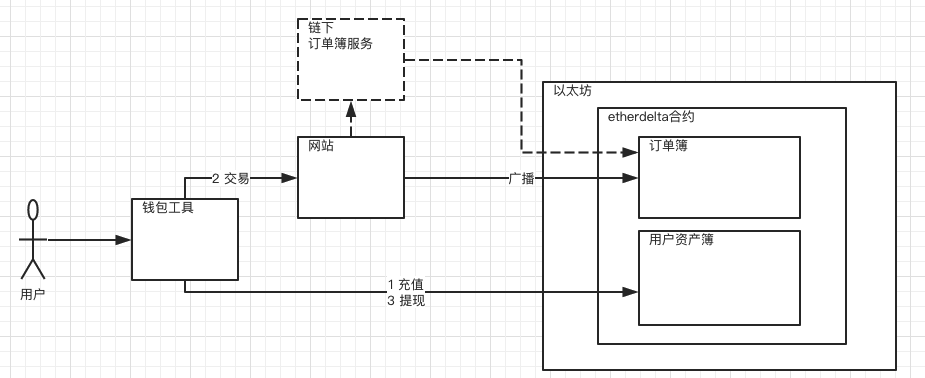
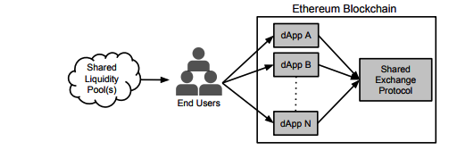
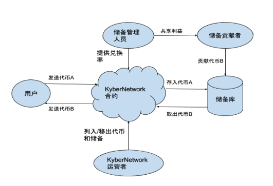
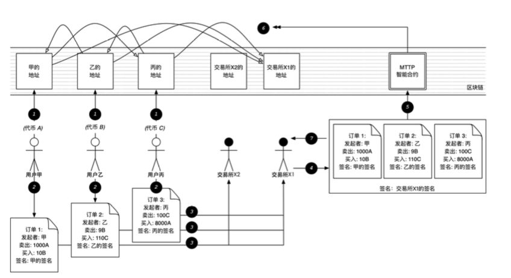

*本文由币乎社区（bihu.com）内容支持计划赞助*

*本文为个人学习与思考总结，欢迎指正,不代表任何立场。*
*欢迎转载 请注明出处*
*作者微信号：scut-guo*

<!-- TOC -->

- [闲聊以太坊的去中心化交易所](#闲聊以太坊的去中心化交易所)
    - [中心化 VS 去中心化](#中心化-vs-去中心化)
        - [中心化交易所](#中心化交易所)
        - [去中心化交易所](#去中心化交易所)
        - [总结](#总结)
    - [去中心化交易所的几个技术实现](#去中心化交易所的几个技术实现)
        - [EtherDelta](#etherdelta)
        - [0x Project](#0x-project)
        - [KyberNetwork](#kybernetwork)
        - [Loopring](#loopring)

<!-- /TOC -->

# 闲聊以太坊的去中心化交易所

交易模式分为两种，成交单主导和报价单主导。第一种是成交单主导，俗称场内交易，指的是有交易所将买卖双方聚集在一起进行竞价交易的交易方式。这种方式中交易所负责用户管理、资产托管、交易撮合、资产清算、履约担保等功能。第二种是报价单主导，俗称场外交易，指的是买卖方不通过第三方而直接成为交易对手的交易方式。场外交易更多的是是双方私下协议并不透明。大多数情况下，人们都会选择场内交易，除非特殊情况下，才会将场外交易作为备选补充选择。

现在市场上主流的场内交易所主要有Poloniex、Bittrex、Bitfinex、Yunbi、Okcoin、Kraken、Liqui等等，它们为区块链市场的资产代币化发展提供了全球化全天候的充足流动性。然而这些交易所是中心化的，中心化存在一些显著的风险和问题。因此有些社区团队做出了基于区块链去中心的特性在区块链网络上来搭建去中心化交易所的尝试。譬如EtherDela、0x、Kyber、Loopring等。

将去中心化的区块链资产放到去中心化的区块链网络上交易，看起来是个很顺理成章也很棒的想法？

## 中心化 VS 去中心化

一切以用户的需求出发。

对于普通用户来说，对于区块链资产交易，最关心的是什么？在个人看来就是三要素，**安全、成本、体验**。

安全，包括资产安全、个人信息安全、交易安全。成本，就是交易成本、充值成本、提现成本。体验，就是交易速度、操作顺畅、高可用。用户想要的是尽可能高的安全性、尽可能低的成本、尽可能爽的用户体验。

### 中心化交易所

从业务视角来看，中心化交易所一般都提供了以下的业务模块，账户体系、KYC、充值资产、资产托管、撮合交易、资产清算、资产兑换等等。尽管业务模块多且杂，但中心化交易所在技术实现上是有传统成熟解决方案的，即使面对海量大并发实时交易，依旧可以给用户提供很好的服务体验。另外，中心化交易所庞大的用户量和交易量，也带来了足够的交易深度，提供了充分的流动性。

中心化交易所的交易成本从经济上看是由市场环境和监管政策决定的。它可以根据运营策略来制定变化的手续费规则。为了鼓励用户高频交易，甚至可以不收取交易手续费。但一般都会对资产提现进行收取手续费。另外由于中心化交易所的所有交易实质都是IOU记账，所以从技术上看交易成本是非常低的。

中心化交易所最大的问题在于中心化背书带来的风险。由于资产的第三方背书集中式托管，所以就会面临包括内部运营风险、黑客攻击风险、商业道德风险、资产盗用等严重影响用户资产安全的风险。

### 去中心化交易所

从业务视角来看，去中心化交易所就简单的多，它只需要承担主要的资产托管、撮合交易及资产清算。而不需要承担像中心化交易所所需要承担的非交易的功能像账户体系、KYC、法币兑换等等。并且与中心化交易所很大的不同在于，所有的这一切都通过开源智能合约来实现，将资产托管、撮合交易、资产清算都放在区块链上。

用智能合约来实现去中心化去信任的交易机制，一方面解决了中心化交易所固有的安全问题，但另一方面也带来了体验和成本上的问题。

在去中心化交易所中，用户在区块链上的账户公钥就是身份，不需向交易所注册个人信息因此就不存在个人信息安全问题也不需要KYC。用户的资产托管于智能合约因此不存在资产安全风险。用户的托管资产可以自由转移无需任何人审批，安全上得到了足够的保障。但用户本身也需要对账户公私钥有足够的安全操作知识才能保障足够安全。

用户在去中心化交易所的一切资产&交易操作是以区块链交易来驱动的，因此既时上就受到区块链本身的确认速度的影响，在目前以太坊上交易确认大约需要几十秒的时间，这对用户体验而言并不友好。交易成本也会受到区块链本身交易费用的影响，因此对于小额交易而言交易成本会变得很高。另外由于区块链网络交易处理性能低下，并不能处理大并发的实时交易，所以在交易量和交易深度上远远不如中心化交易所，流动性上有所受限。

### 总结

总结而言，中心化交易所的优势在于，优秀的用户体验，可以接受的交易成本，充足的流动性。劣势在于安全上。去中心化交易所的优势在于去信任化带来的安全保障上。但交易成本较高，用户体验较差。

## 去中心化交易所的几个技术实现

### EtherDelta

[EtherDelta](https://etherdelta.com) 是基于以太坊的以太币与ERC20代币互换的开源去中心交易平台（智能合约[github](https://github.com/etherdelta/smart_contract)地址）。

上图是EtherDelta的技术实现概览。

它主要由两部分组成，一个是EtherDelta网站，另一个是etherdelta智能合约。

EtherDelta网站是提供给用户操作的界面接口。用户可以在网站上充值，体现，挂单交易。

etherdelta智能合约是部署于以太坊上的特定版本地址智能合约。合约中主要实现了用户资产托管登记簿和订单簿。订单簿中以代币为维度维护了所有当前所有成交挂单和未成交挂单。用户资产登记簿主要是维护了用户的代币资产和支持成交挂单的资产清算。

由于EtherDelta是交易驱动的模式，所以用户的所有操作都需要普通的以太坊交易来触发。因此，用户需要依赖以太坊钱包工具来执行交易指令，譬如MetaMask钱包。一个正常的流程可能是这样的：

1. 充值。用户通过钱包工具向以太坊etherdelta合约发起充值函数调用。该交易会将代币资产转账至合约，etherdelta合约会对该笔转让资产进行接收和登记托管于资产簿中。
2. 挂单交易。用户在网站挂单列表中相中一笔挂单符合成交预期，则在网站上取得该挂单相关信息，组成交易指令，并通过钱包工具对交易指令进行签名，并通过网站向以太坊网络广播。以太坊etherdelta合约执行交易指令，对相关代币比例进行计算和交易费用计算，如果订单正常成交，则会进行买卖双方的订单清算，并更新到用户资产登记薄中。
3. 提现。用户通过钱包工具向以太坊etherdelta合约发起提现函数调用。该交易会将代币资产从合约转账至用户个人账户地址，etherdelta合约会对该笔转让资产更新至资产簿中。

如果用户挂单需要取消，则和挂单交易一样的步骤，需要通过钱包工具组装取消交易指令来调用etherdelta合约更新其上的订单簿。这种情况下，对于没有成交的挂单，则发出了两次以太坊交易，浪费了交易费用。因此这里有个简单的优化，既是在EtherDelta网站存在一个链下订单簿缓存服务，对于并未成交的订单缓存于链下，只有真正成交了才将交易广播到以太坊网络中，如果没有成交，就可以随时在链下无成本取消。

另外需要注意的是，对一个以太坊账户而言，它所发出的交易的顺序递增特性是很重要的 ，它必须是顺序增长。因此，这个特性对EtherDelta的操作来说特别重要，一旦乱序，交易指令就会无法正常执行。

EtherDelta技术实现的核心主要有两点，其一是智能合约的资产托管，它保障了去中心化去信任化的资产安全交易，用户资产只会在用户私有账户和托管合约中转移，并且只能由用户自己发起。然而安全也不是绝对的，由于用户侧安全操作方面依然有可能给攻击者提供机会([去中心化交易所以德(EtherDelta)被盗--我们如何从中吸取教训](https://mp.weixin.qq.com/s?__biz=MzI5OTc2NjA3MQ==&mid=2247483770&idx=1&sn=4cd0a09a76b008477234c4ed5c704a12&key=2bcf5ce5a13cfb5f23eed3714c55959a423367281bc7a5485327781320c3064d43aa4f130a1c346aa91c2c547e9b18dc344fee3ff6bc43db587d30a7ec91f50c8e95ff4e71c30cc301d3286681e1154f&ascene=0&uin=MjM0MDg0MjE1&devicetype=iMac+MacBookAir7%2C2+OSX+OSX+10.11.3+build(15D21)&version=11020201&pass_ticket=axNVU7JcGqcSIhfKWgQ2xxSGT3V%2FxaWMJ6a5TY4b5tQ%3D)。其二是交易驱动的模式，对普通用户而言，有较高的操作门槛。任何的资产操作和交易操作都是通过以太坊交易来驱动，也因此导致了交易速度慢，交易深度不够，交易费用高，交易列表更新不及时，交易序号无效，交易重复，交易不能合并成交等等很多广泛被用户诟病的问题。

尽管有各种各样的问题，EtherDelta模式简单清晰，起步较早，上线一年多，随着以太坊生态的发展和用户教育的进步也积累了一定量的用户和可观的成交量。它是以太坊上去中心化交易所的先行者，对后来者有一定的启发作用。后来者大多都借鉴认可EtherDelta的智能合约资产托管设计，并试图在成本和体验两个要素上做进一步的优化设计。

### 0x Project 

[0x](https://www.0xproject.com/)和EtherDelta不同。它不是交易平台，它是一个开源的去中心交易协议。它的目标是成为以太坊生态上各种Dapp的共享基础设施，它期望成为区块链生态中开放的技术标准规范。

0x的技术实现中，引入了Relayer的概念。Relayer可以理解是任何实现了0x协议和提供了链下订单簿服务的做市商、交易所、Dapp等等。Relayer的订单簿技术实现可以是中心化的也可以是非中心化的。Relayer从成交交易中收取手续费获利。交易过程大略如下：

1. Relayer设置自身的交易服务费用规则，并对外提供订单簿服务。

2. Maker选定一个Relayer进行挂单创建和填充必要的订单，手续费信息，并用私钥签名。

3. Maker将签名后的订单提交给Relayer.

4. Relayer对订单做必要的检查，并将其更新到自身的订单簿。

5. Takers监看到订单簿的更新，并选中成交订单。

6. Takers对选中的订单进行填充，并广播至区块链完成最后的成交。

   ​

0x 相比于EtherDelta更好的利用了去中心化和中心化各自的优势，把链上链下作了结合。它把清算功能保留在链上，同时把交易撮合放到链下来处理。一方面保障了用户资产安全，另一方面借助链下的Relayer提升了用户体验也降低了用户交易成本。在关键的三要素上，与EtherDelta相比，有了很大的进步。

但有一点需要注意的是，Relayer和Relayer之间是割裂的，Relayer之间由于利益上关系彼此是互相竞争的。如果Relayer自身用户并不多、交易量不足、交易深度不够那流动性上会有所欠缺。未来如果以太坊Dapp生态发展顺利，Dapp遍地开花，且普通Dapp都能达到百万级别用户量的基础上，0x协议会有广泛的应用基础。

### KyberNetwork

[Kyber](https://kyber.network/) 是个专注于链上资产去中心化互换的交易所。它的目标是解决中心化的风险、即时交易、交易品种繁杂等等问题。但在具体实现上它和传统交易所有很大的不同，它强调的是基于代币储备库的兑换而不是挂单交易的处理。

Kyber引入了储备贡献者的角色为代币储备库提供代币，引入了储备库管理者来管理运营储备库。每个储备库都由对应的储备管理者来运营，由其负责周期性设置储备库兑换率，并利用储备库对普通用户提供的兑换折价来获取利益，该利益由储备管理者和储备贡献者共同分享。储备库与储备库之间是互相竞争关系，以保障给用户提供最优的兑换价格。KyberNetwork为储备库管理者提供平台，并设有KyberNetwork的全局运营者对所有储备库、储备库管理者进行集中管理维护。

Kyber基于储备库的基础上支持了去中心化的各类自由兑换的即时支付API，强调了流动性保证。但这些也是有前提的，就是代币要有充足的储备库。

### Loopring

[Loopring](https://loopring.org/) 是类0x的去中心化的交易协议，从整体思路上与0x Project是非常类似的，也主要是受到0x的启发。

Loopring与0x一样的地方是，链上智能合约负责资产托管、实施撮合成交，链下负责订单匹配。

具体技术实现上的不同点，其一是，Loopring将撮合扩展到了多币种多订单上，既白皮书所说的链上交易环路撮合技术，鼓励交易所匹配最大折扣的成交路径，为用户节省交易成本的同时交易所也有利可图。但另一方面也增加了智能合约的复杂度和以太坊交易的执行成本，在实际应用中效果如何还有待观察。其二是，设计了经济激励机制，提倡交易所从交易手续费为主的模式转变为成本节约分润为主的模式。其三是，交易所之间是互相平等竞争的关系，用户的订单可以选择发送给一个或多个交易所，甚至为了快速达成，可以发送给全网所有的交易所，尽管这样会给市场深度带来好处，让成交更快更有效，但对于交易所而言也会带来抢单的问题，因为理论上大部分交易所对于链上订单合约的变更的感知速度是一样的，因此对于同样的订单匹配，不同交易所就会各自发送相同的撮合请求到链上，造成大量无效的撮合交易。