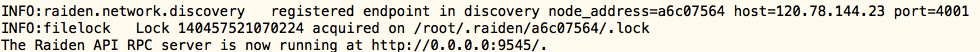

# 雷电网络开发预览版-初体验

*本文由币乎社区（bihu.com）内容支持计划赞助*

*欢迎指正,不代表任何立场。* *欢迎转载 请注明出处* *作者微信号：scut-guo*

<!-- TOC -->

- [雷电网络开发预览版-初体验](#雷电网络开发预览版-初体验)
    - [Raiden 环境搭建](#raiden-环境搭建)
        - [1. 下载Raiden执行文件](#1-下载raiden执行文件)
        - [2. 安装Parity 客户端](#2-安装parity-客户端)
        - [3. 准备账号](#3-准备账号)
        - [4. 启动Parity 同步ropsten 测试网络](#4-启动parity-同步ropsten-测试网络)
        - [5. 在Ropsten给账号增加以太balance](#5-在ropsten给账号增加以太balance)
        - [6. 启动Raiden](#6-启动raiden)
        - [7. 检查是否运行正常](#7-检查是否运行正常)
    - [节点交互](#节点交互)
        - [1. 调用RTT合约转账给A、B账户使其先拥有RTT余额](#1-调用rtt合约转账给ab账户使其先拥有rtt余额)
        - [2. A、B节点自动连接RTT network（可选）](#2-ab节点自动连接rtt-network可选)
        - [3. A与B建立直接的状态通道](#3-a与b建立直接的状态通道)
        - [4. A节点查看状态通道信息](#4-a节点查看状态通道信息)
        - [5. 向状态通道deposit（可选）](#5-向状态通道deposit可选)
        - [6. A向B节点 发起RTT转账1](#6-a向b节点-发起rtt转账1)
        - [7. 查询通道的事件信息](#7-查询通道的事件信息)
        - [8. 关闭状态通道](#8-关闭状态通道)
        - [9. 节点离开RTT network（可选）](#9-节点离开rtt-network可选)
    - [其他](#其他)

<!-- /TOC -->

以下内容在ubuntu机器 ，**Ropsten**测试网络实测ok。

*注意：随着Raiden开发的不断推进，本文内容有可能不适用未来最新版本*

## Raiden 环境搭建

### 1. 下载Raiden执行文件

   ```
   wget https://github.com/raiden-network/raiden/releases/download/v0.1.0/raiden--x86_64.AppImage
   mv raiden--x86_64.AppImage raiden
   chmod +x raiden
   ```

### 2. 安装Parity 客户端

   ```
   wget https://parity-downloads-mirror.parity.io/v1.7.6/x86_64-unknown-linux-gnu/parity_1.7.6_amd64.deb
   dpkg -i parity_1.7.6_amd64.deb 
   ```

### 3. 准备账号

   ```
   parity account new --chain ropsten --keys-path ~/.local/share/io.parity.ethereum/keys/ethereum/
   ```

   新建两个eth账户。Raiden节点使用eth地址来标识。

   下文假设A账户为0x607f1724469a0beeed74e1429c3c5adcf8290fa3，B账户为0x17cb47f30f844b6969e8cc6cd3c506eb25f17819。

   ​

### 4. 启动Parity 同步ropsten 测试网络

   ```
   #parity db kill --chain ropsten
   parity --geth --keys-path ~/.local/share/io.parity.ethereum/keys/ethereum/ --chain ropsten --bootnodes "enode://20c9ad97c081d63397d7b685a412227a40e23c8bdc6688c6f37e97cfbc22d2b4d1db1510d8f61e6a8866ad7f0e17c02b14182d37ea7c3c8b9c2683aeb6b733a1@52.169.14.227:30303,enode://6ce05930c72abc632c58e2e4324f7c7ea478cec0ed4fa2528982cf34483094e9cbc9216e7aa349691242576d552a2a56aaeae426c5303ded677ce455ba1acd9d@13.84.180.240:30303"
   ```

   parity默认已开启Warp sync。等待网络同步完成再执行后面的操作。否则raiden启动的时候会报Raiden的Registry合约无法找到的错误。

   ​

### 5. 在Ropsten给账号增加以太balance 

   因为raiden中加入网络和建立通道都需要发送交易，所以要求对应账户的eth余额不能为0。

   打开 http://faucet.ropsten.be:3001/  给4中的账户发送ether。

### 6. 启动Raiden

   配置不同的端口，启动两个节点：

   ```
   ./raiden --keystore-path ~/.local/share/io.parity.ethereum/keys/ethereum/test/ --api-address 0.0.0.0:9545 --listen-address 0.0.0.0:4001

   ./raiden --keystore-path ~/.local/share/io.parity.ethereum/keys/ethereum/test/ --api-address 0.0.0.0:9546 --listen-address 0.0.0.0:4002

   ```

   选择不同的账户，并输入密码解锁。

   正常启动情况下会输出API端口信息。

   

   后面与Raiden都是通过Restful API来交互。

### 7. 检查是否运行正常

   ```
   curl http://127.0.0.1:9545/api/1/address
   #返回 {"our_address": "0x607f1724469a0beeed74e1429c3c5adcf8290fa3"}

   curl http://127.0.0.1:9546/api/1/address
   #返回 {"our_address": "0x17cb47f30f844b6969e8cc6cd3c506eb25f17819"}
   ```

   输出的地址与启动时候所选择的账户地址一致，则已正常运行。

至此，两个节点的Raiden环境已经搭建起来了。

## 节点交互

通过API可以向网络注册新的Token Network，也可以直接接入一个已注册的Token Network，可以与其他Raiden节点建立Channel并Deposit到Channel，还有其他的一些相关操作。详细可以看Raiden 的[API说明](http://raiden-network.readthedocs.io/en/stable/api_walkthrough.html#) 。

Raiden提供了一个已注册好的Raiden Testnet Token (RTT)。RTT地址是`0x0f114a1e9db192502e7856309cc899952b3db1ed`。

下面的内容是对部分API的简单体验过程。

### 1. 调用RTT合约转账给A、B账户使其先拥有RTT余额

使用web3.js调用以下代码发起账户转账RTT 代币的交易。注意调用之前先解锁账户。

```
var addr='0x607f1724469a0beeed74e1429c3c5adcf8290fa3';#改成自己的账户地址
var rtt_token_abi = Contract ABI; #可以从https://ropsten.etherscan.io/address/0x0f114a1e9db192502e7856309cc899952b3db1ed#code 获取
var rtt_token_address = "0x0f114a1e9db192502e7856309cc899952b3db1ed";
var rtt_token = web3.eth.contract(rtt_token_abi).at(rtt_token_address);
rtt_token.mint({from:addr}); // adjust to your raiden account and unlock first!

console.log(rtt_token.balanceOf(addr).toString());
```

每调用一次，RTT增加100。调用完之后，可以在https://ropsten.etherscan.io/address/账户地址 查看交易状态。如果交易上链了，账户的RTT代币余额就会增加，可以多调几次，使得余额充足，方便后面的通道转账。

### 2. A、B节点自动连接RTT network（可选）

```
#对A节点
curl -X PUT -H "Content-Type: application/json" -d '{"funds":100}' http://127.0.0.1:9545/api/1/connection/0x0f114a1e9db192502e7856309cc899952b3db1ed

#对B节点
curl -X PUT -H "Content-Type: application/json" -d '{"funds":100}' http://127.0.0.1:9546/api/1/connection/0x0f114a1e9db192502e7856309cc899952b3db1ed
```

正常情况下输出状态变更事件消息：

```
INFO:raiden.network.rpc.client  new_netting_channel called peer1=a6c07564 netting_channel=4b644413 peer2=0f658429
INFO:raiden.event_handler       state_change received state_change=<raiden.transfer.mediated_transfer.state_change.ContractReceiveNewChannel object at 0x7fa497756bd0>
INFO:raiden.network.rpc.client  deposit called amount=400 contract=4b644413
INFO:raiden.event_handler       state_change received state_change=<raiden.transfer.mediated_transfer.state_change.ContractReceiveBalance object at 0x7fa497706f10>
INFO:raiden.network.rpc.client  new_netting_channel called peer1=a6c07564 netting_channel=ea955179 peer2=9598decb
INFO:raiden.event_handler       state_change received state_change=<raiden.transfer.mediated_transfer.state_change.ContractReceiveNewChannel object at 0x7fa497706ad0>
INFO:raiden.event_handler       state_change received state_change=<raiden.transfer.mediated_transfer.state_change.ContractReceiveBalance object at 0x7fa497730890>
INFO:raiden.network.rpc.client  deposit called amount=400 contract=ea955179
ERROR:raiden.tasks      alarm missed 1 blocks 
ERROR:raiden.tasks      alarm missed 2 blocks 
INFO:raiden.network.rpc.client  new_netting_channel called peer1=a6c07564 netting_channel=7c2bfbda peer2=82710a71
INFO:raiden.event_handler       state_change received state_change=<raiden.transfer.mediated_transfer.state_change.ContractReceiveNewChannel object at 0x7fa497730f90>
INFO:raiden.network.rpc.client  deposit called amount=400 contract=7c2bfbda
INFO:raiden.event_handler       state_change received state_change=<raiden.transfer.mediated_transfer.state_change.ContractReceiveBalance object at 0x7fa49773c1d0>
```

每个节点执行成功之后，节点就会自动加入RTT network并且与其他三个随机的节点建立状态通道，并且每个channel会deposit 20%的funds，剩余的40%funds留给新加进来的节点来建立状态通道。

如果是RTT余额不足，Raiden客户端会提示：

```
INFO:raiden.network.rpc.client  new_netting_channel called peer1=1fb444d0 netting_channel=fd0a1d0e peer2=82710a71
```

### 3. A与B建立直接的状态通道

```
curl -X PUT -H "Content-Type: application/json" -d '{"partner_address": "0x17cb47f30f844b6969e8cc6cd3c506eb25f17819","token_address": "0x0f114a1e9db192502e7856309cc899952b3db1ed","balance": 100,"settle_timeout": 600}' http://127.0.0.1:9545/api/1/channels

```

其中partner_address是节点地址，即B节点地址，token_address是token地址，即RTT的地址。

正常建立情况下会有类似提示：

```
INFO:raiden.event_handler       state_change received state_change=<raiden.transfer.mediated_transfer.state_change.ContractReceiveNewChannel object at 0x7f7f1ed34e50>
INFO:raiden.network.rpc.client  deposit called amount=100 contract=721d03ec
```

### 4. A节点查看状态通道信息

   ```
   curl -X GET http://127.0.0.1:9545/api/1/channels
   返回：
   [
     {
       "balance": 100, 
       "channel_address": "0x721d03ec76ccbfdce0ad3fc4602b59d622304d25", 
       "partner_address": "0x17cb47f30f844b6969e8cc6cd3c506eb25f17819", 
       "reveal_timeout": 10, 
       "settle_timeout": 600, 
       "state": "opened", 
       "token_address": "0x0f114a1e9db192502e7856309cc899952b3db1ed"
     }
   ]

   curl -X GET http://127.0.0.1:9546/api/1/channels
   返回：
   [
     {
       "balance": 0, 
       "channel_address": "0x504750b7b1e0940119f3d0bad11e2fc766ab97a1", 
       "partner_address": "0x0c599ace7e0a7ff7c0ce6ba1c50f35ec58c04e86", 
       "reveal_timeout": 10, 
       "settle_timeout": 400, 
       "state": "opened", 
       "token_address": "0x0f114a1e9db192502e7856309cc899952b3db1ed"
     }
   ]
   ```

   从返回可以看出，state为opened，状态通道中A余额为100，B余额为0。

### 5. 向状态通道deposit（可选）

   从4 中可以看到B和A节点的状态通道的balance。也可以deposit。

   ```
   curl -X PATCH -H "Content-Type: application/json" -d '{"balance":50}' http://127.0.0.1:9545/api/1/channels/0x721d03ec76ccbfdce0ad3fc4602b59d622304d25 #注意是channel_address
   ```

   ​

### 6. A向B节点 发起RTT转账1

```
curl -H "Content-Type:application/json" -X POST --data '{"amount":1}' http://127.0.0.1:9545/api/1/transfers/0x0f114a1e9db192502e7856309cc899952b3db1ed/0x17cb47f30f844b6969e8cc6cd3c506eb25f17819# 节点地址
```

返回：

```
{
  "amount": 1, 
  "identifier": 6913515701748887592, 
  "initiator_address": "0x607f1724469a0beeed74e1429c3c5adcf8290fa3", 
  "target_address": "0x17cb47f30f844b6969e8cc6cd3c506eb25f17819", 
  "token_address": "0x0f114a1e9db192502e7856309cc899952b3db1ed"
}
```

转账成功。

此时再次查询状态通道信息

```
curl -X GET http://127.0.0.1:9545/api/1/channels
[
  {
    "balance": 99, 
    "channel_address": "0x721d03ec76ccbfdce0ad3fc4602b59d622304d25", 
    "partner_address": "0x17cb47f30f844b6969e8cc6cd3c506eb25f17819", 
    "reveal_timeout": 10, 
    "settle_timeout": 600, 
    "state": "opened", 
    "token_address": "0x0f114a1e9db192502e7856309cc899952b3db1ed"
  }
]

curl -X GET http://127.0.0.1:9546/api/1/channels
[
  {
    "balance": 1, 
    "channel_address": "0x721d03ec76ccbfdce0ad3fc4602b59d622304d25", 
    "partner_address": "0x607f1724469a0beeed74e1429c3c5adcf8290fa3", 
    "reveal_timeout": 10, 
    "settle_timeout": 600, 
    "state": "opened", 
    "token_address": "0x0f114a1e9db192502e7856309cc899952b3db1ed"
  }
]
```

从返回可以看出，状态通道中A余额为99，B余额为1。

### 7. 查询通道的事件信息

``` 
curl -X GET http://127.0.0.1:9545/api/1/events/channels/0x721d03ec76ccbfdce0ad3fc4602b59d622304d25#状态通道地址

返回
[{"block_number": 1892761, "participant": "607f1724469a0beeed74e1429c3c5adcf8290fa3", "event_type": "ChannelNewBalance", "balance": 100, "token_address": "0f114a1e9db192502e7856309cc899952b3db1ed"}, {"block_number": 1892768, "participant": "607f1724469a0beeed74e1429c3c5adcf8290fa3", "event_type": "ChannelNewBalance", "balance": 600, "token_address": "0f114a1e9db192502e7856309cc899952b3db1ed"}, {"block_number": 1892781, "participant": "607f1724469a0beeed74e1429c3c5adcf8290fa3", "event_type": "ChannelNewBalance", "balance": 650, "token_address": "0f114a1e9db192502e7856309cc899952b3db1ed"}, {"block_number": 1892786, "event_type": "EventTransferSentSuccess", "identifier": 6913515701748887592}]
```

会看到状态通道所有的事件消息。

### 8. 关闭状态通道

   ```
   curl -X PATCH -H "Content-Type: application/json" -d '{"state":"closed"}' http://127.0.0.1:9545/api/1/channels/0x721d03ec76ccbfdce0ad3fc4602b59d622304d25 #注意是channel_address
   ```

   此时再次查询状态通道信息

   ```
   curl -X GET http://127.0.0.1:9545/api/1/channels
   ```

   ​


### 9. 节点离开RTT network（可选）

```
curl -X "DELETE" -H "Content-Type: application/json" -d '{"only_receiving_channels": false}' http://127.0.0.1:9546/api/1/connection/0x0f114a1e9db192502e7856309cc899952b3db1ed
```


## 其他

为了简化测试体验，Raiden提供了一个特殊的Raiden Echo Node。Raiden Echo Node地址是`0x02f4b6bc65561a792836212ebc54434db0ab759a`。体验过程可以只建立一个节点与Raiden Echo Node交互。

**Enjoy Raiden!**


